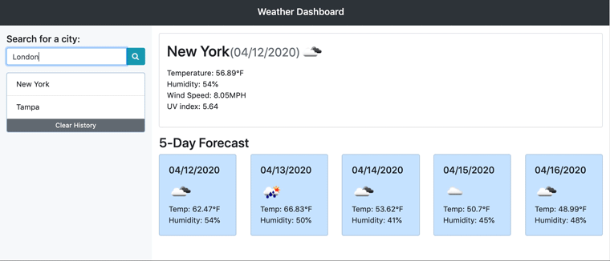

# Weather Dashboard

This project is a weather dashboard using the OpenWeather API.

<a href="https://franklintendo.github.io/homework-6-weather-dashboard/" target="_blank">Click here</a> to view the project.


## Overview

This project is a weather dashboard application with search functionality to find current weather conditions and the future weather outlook for multiple cities. 




## User Story

```
As a traveler
I want to see the weather outlook for multiple cities
so that I can plan a trip accordingly
```

How do you deliver this? Here are some guidelines:

* Uses the [OpenWeather API](https://openweathermap.org/api) to retrieve weather data for cities.

* Uses AJAX to hook into the API to retrieve data in JSON format.

* Runs in the browser and features dynamically updated HTML and CSS powered by jQuery.

* Displays the following under current weather conditions:

  * City

  * Date

  * Icon image (visual representation of weather conditions)

  * Temperature

  * Humidity

  * Wind speed

  * UV index

* Includes a search history so that users can access their past search terms. Clicking on the city name performs a new search that returns current and future conditions for that city. 

* Includes a 5-Day Forecast below the current weather conditions. Each day for the 5-Day Forecast displays the following:

  * Date

  * Icon image (visual representation of weather conditions)

  * Temperature

  * Humidity

* Uses `localStorage` to store any persistent data (loads last searched city forecast on page load and search history).

<a href="https://franklintendo.github.io/homework-6-weather-dashboard/" target="_blank">Click here</a> to view the project.


